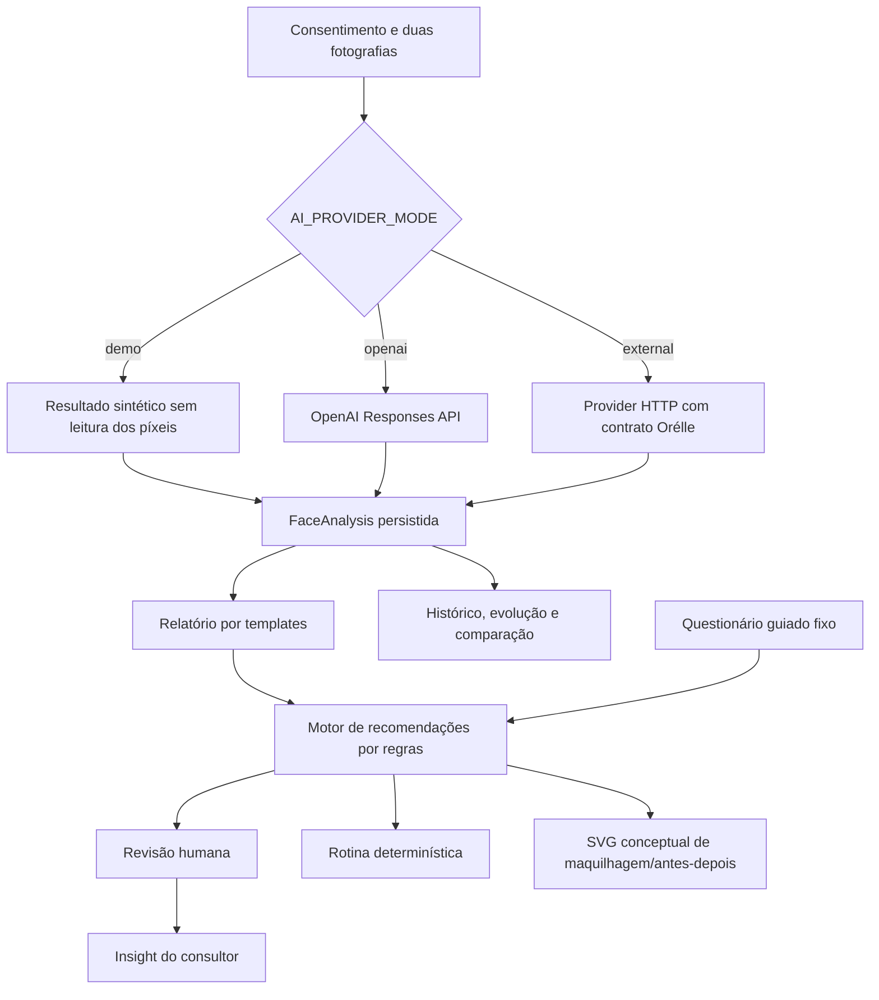

# Relatório da implementação de IA — Orélle `real_dev`

> **Documento histórico superseded.** Este relatório descreve o estado auditado antes da implementação OpenAI-only. O contrato e a evidência atuais estão no [plano vivo da consulta cosmética OpenAI](PLANO-IMPLEMENTACAO-CONSULTA-IA-OPENAI-real_dev.md). O conteúdo abaixo é preservado como histórico e não deve ser usado como instrução de runtime.

> Estado: `CONCLUIDO — AUDITORIA READ-ONLY`
>
> Data: 2026-07-11
>
> Âmbito: `real_dev/api`, `real_dev/web` e documentação necessária para interpretar a implementação.
>
> Fora de âmbito: `apps/`, alteração do comportamento, utilização do `.env` existente, ligação à base remota e chamadas a providers externos.

## 1. Resposta direta

A IA real **continua implementada**. O código contém duas vias reais de análise multimodal das fotografias:

1. integração direta com a OpenAI Responses API;
2. adapter para um provider HTTP externo que cumpra o contrato definido pela Orélle.

Contudo, a execução local normal da aplicação nunca usa essas vias. Tanto `npm run dev` como `npm run dev:local` removem a configuração de providers e fixam `AI_PROVIDER_MODE=demo`. O E2E também força `demo`.

O modo `demo` não analisa a pele nem os píxeis das fotografias. Devolve valores sintéticos determinísticos e usa apenas metadados técnicos do upload para variar ligeiramente uma confiança artificial.

A conclusão factual é, portanto:

- existe integração de IA real no código;
- a integração real não foi removida;
- não existe um percurso local canónico para a demonstrar;
- não existe evidência de uma chamada end-to-end a um provider real;
- apenas a extração dos cinco indicadores faciais pode usar IA real;
- consulta, recomendações, relatório, rotina, evolução, maquilhagem e revisão são maioritariamente regras, templates ou trabalho humano.

## 2. Porque foi feita a alteração para `demo`

A alteração ocorreu porque o plano de correção fornecido para a auditoria fechava explicitamente estas decisões:

- desenvolvimento académico em `demo`, sempre identificado como simulação;
- modo real em `openai` ou `external`;
- consentimento específico para providers reais;
- configuração obrigatória;
- ausência de fallback silencioso de um provider real para a baseline local.

Além disso, o estado anterior tinha um problema real:

- o modo chamava-se `local`, mas não executava IA;
- fabricava findings a partir do tamanho/MIME das fotografias;
- podia ser apresentado como análise verdadeira;
- falhas de rede, timeout ou `5xx` de um provider real terminavam silenciosamente nessa baseline sintética;
- a persistência não distinguia modo, simulação e versão do provider.

Renomear essa baseline para `demo`, identificá-la visualmente e remover o fallback silencioso foi uma correção necessária de honestidade e segurança. O erro de adequação à PAP foi outro: o launcher local passou a forçar sempre `demo`, sem ficar disponível um comando equivalente e seguro para executar a integração real.

Eu devia ter assinalado explicitamente esse conflito antes de considerar a fase encerrada: para uma PAP cuja proposta de valor depende da IA, ter código real inacessível no percurso normal enfraquece materialmente a demonstração.

Referência histórica: `docs/planificacao/PLANO-CORRECAO-AUDITORIA-COMPLETA-real_dev.md:163-186`.

## 3. Método e limites desta auditoria

Foram realizadas:

- leitura estática das rotas, controllers, services, providers, modelos, migrations e testes relacionados com IA;
- pesquisa de todas as chamadas `fetch()` no backend;
- rastreio das funcionalidades desde os ecrãs React até à persistência;
- classificação entre IA real, simulação, automação determinística, visualização conceptual e revisão humana;
- execução de testes focados da API e da suite frontend.

Não foram realizadas:

- leitura do `.env` real;
- ligação a MongoDB remoto;
- execução contra OpenAI ou outro provider;
- avaliação científica da qualidade dos resultados;
- alteração de código ou configuração.

A pesquisa de rede encontrou apenas duas chamadas `fetch()` no backend, ambas no mesmo ficheiro:

- `real_dev/api/src/providers/external-skin-analysis.provider.js:636` — provider genérico;
- `real_dev/api/src/providers/external-skin-analysis.provider.js:708` — OpenAI.

Não existe SDK de IA nas dependências. A integração usa o `fetch` nativo do Node. Também não existem TensorFlow, Azure Face, OpenCV, embeddings, RAG, fine-tuning, modelo ML local ou chatbot funcional.

## 4. Mapa honesto das funcionalidades

| Funcionalidade apresentada | Implementação efetiva | Classificação |
|---|---|---|
| Análise facial em `openai` | Envia duas imagens à OpenAI Responses API e exige JSON estruturado | **IA real multimodal** |
| Análise facial em `external` | Envia duas imagens a um serviço HTTP configurado | **IA real se o serviço externo usar IA** |
| Análise facial em `demo` | Valores sintéticos fixos e confiança derivada de metadados | **Simulação; não IA** |
| Relatório facial | Interpolação dos findings e quatro sugestões fixas | **Regras/templates** |
| Consulta guiada | Questionário de cinco perguntas fixas | **Formulário determinístico** |
| Recomendações | Ranking com pesos, palavras-chave e filtros | **Motor de regras** |
| Explicabilidade | Frases estáticas associadas a reason codes | **Templates** |
| Fairness | Allowlist de inputs, bloqueios e regex | **Guard determinístico** |
| Feedback útil/não relevante | Atualiza estado e guarda feedback | **Persistência; não treina modelo** |
| Histórico IA | Timeline minimizada de eventos internos | **Auditoria/workflow** |
| Revisão da consulta | Decisão de consultor/admin | **Revisão humana** |
| Insights do consultor | Publicação da nota humana | **Revisão humana** |
| Rotina diária | Alterna produtos recomendados entre manhã/noite | **Regras/templates** |
| Alertas de rotina | Compara hora UTC e cria notificação por regra | **Scheduler determinístico** |
| Evolução da pele | Converte labels em escala `1/2/3` | **Transformação determinística** |
| Comparação da pele | Compara textualmente labels de duas análises | **Transformação determinística** |
| Maquilhagem virtual | Gera uma cara SVG genérica com cor derivada do ID do produto | **Pré-visualização conceptual** |
| Antes/depois | Combina SVGs e nomes de produtos | **Pré-visualização conceptual** |
| Chat da homepage | Markup estático sem endpoint | **Conteúdo promocional** |

### 4.1 Arquitetura funcional atual



## 5. Núcleo de IA real: análise facial

### 5.1 Entrada e consentimento

O percurso começa em `/pele/fotografias`.

Endpoints:

- `GET /api/face-consent`;
- `POST /api/face-consent`;
- `DELETE /api/face-consent`;
- `POST /api/face-photos`.

O frontend consulta o backend para saber se é necessário consentimento específico. Em `openai` ou `external`, o utilizador tem de aceitar:

- o provider exato;
- a versão de aviso configurada;
- envio temporário para análise cosmética;
- ausência de autorização para treino.

Referências:

- `real_dev/api/src/routes/face-photo.routes.js:27-52`;
- `real_dev/api/src/services/face-photo.service.js:85-157`;
- `real_dev/web/src/pages/FacePhotoUploadPage.jsx:32-115` e `:187-242`.

### 5.2 Segurança e normalização das fotografias

O upload:

- aceita exatamente os campos `frontal` e `perfil`;
- aceita JPEG, PNG e WebP declarados;
- limita cada ficheiro a 5 MiB;
- limita o pedido a duas partes de ficheiro;
- escreve temporários com permissões restritas;
- faz cleanup em erro, limite ou abort;
- descodifica efetivamente o conteúdo com `sharp`;
- valida MIME real, dimensões, número de páginas e limite de píxeis;
- aceita no máximo 6000 px por dimensão e 25 milhões de píxeis;
- auto-orienta;
- reencoda para WebP;
- confirma ausência de EXIF/orientation no resultado;
- limita o par normalizado a 10 MiB;
- cifra os bytes em storage privado com AES-GCM e AAD contextual.

Referências:

- `real_dev/api/src/middlewares/face-photo-upload.middleware.js:32-46` e `:125-280`;
- `real_dev/api/src/services/face-photo-normalization.service.js:18-27` e `:96-270`;
- `real_dev/api/src/services/face-secure-storage.service.js:57-192`.

O backend mantém apenas um par ativo. A substituição elimina fisicamente o par anterior.

### 5.3 Endpoint que executa a análise

`POST /api/face-analyses`:

1. autentica o utilizador;
2. aplica a quota `ai`;
3. exige consentimento facial ativo;
4. exige consentimento específico quando o modo é real;
5. carrega o par ativo mais recente;
6. decifra os bytes apenas em memória;
7. chama o provider configurado;
8. relê consentimento e fotografias dentro de uma transação;
9. persiste o resultado apenas se tudo continuar válido.

Referências:

- `real_dev/api/src/routes/face-analysis.routes.js:18-23`;
- `real_dev/api/src/services/face-analysis.service.js:64-103`;
- `real_dev/api/src/services/face-analysis.service.js:118-190`;
- `real_dev/api/src/services/face-analysis.service.js:202-284`.

O budget total da operação é 10 segundos; o provider tem timeout interno de 6 segundos.

### 5.4 Modo `demo`

O `demo` devolve sempre estes valores base:

| Finding | Valor |
|---|---|
| `skinType` | `mista` |
| `acne` | `baixo` |
| `manchas` | `baixo` |
| `rugas` | `baixo` |
| `oleosidade` | `moderada` |

A confiança varia entre limites conservadores a partir de:

- soma do tamanho dos dois ficheiros;
- igualdade ou diferença do MIME.

O conteúdo visual não participa no cálculo. Duas imagens completamente diferentes com os mesmos metadados relevantes podem produzir o mesmo resultado.

O DTO declara:

- `mode: "demo"`;
- `isDemo: true`;
- `providerName: "demo-skin-analysis"`;
- `providerVersion: "1"`;
- limitações que afirmam que não houve análise por IA.

Referência: `real_dev/api/src/providers/skin-analysis.provider.js:43-63` e `:128-181`.

### 5.5 Modo `openai`

A implementação direta usa:

- `POST https://api.openai.com/v1/responses`;
- autenticação `Bearer` com `OPENAI_API_KEY`;
- modelo de `AI_PROVIDER_MODEL`, cujo default no código é `gpt-4.1`;
- duas imagens WebP como data URLs base64;
- `store: false`;
- prompt cosmético não clínico;
- Structured Outputs com JSON Schema estrito;
- `redirect: "error"`;
- timeout de 6 segundos;
- limite de resposta de 256 KiB;
- propagação de cancelamento;
- ausência de fallback para `demo`.

O prompt pede:

- avaliação apenas cosmética;
- JSON compatível com o schema;
- ausência de diagnóstico clínico/doenças/promessas terapêuticas;
- linguagem conservadora;
- processamento imediato sem treino externo;
- os cinco findings obrigatórios.

Referências:

- schema e prompt: `real_dev/api/src/providers/external-skin-analysis.provider.js:21-80`;
- payload: `real_dev/api/src/providers/external-skin-analysis.provider.js:173-229`;
- chamada: `real_dev/api/src/providers/external-skin-analysis.provider.js:691-758`.

### 5.6 Modo `external`

O adapter genérico envia um JSON semelhante a:

```json
{
  "photos": [
    {
      "kind": "frontal",
      "mimeType": "image/webp",
      "sizeBytes": 123456,
      "contentBase64": "..."
    },
    {
      "kind": "perfil",
      "mimeType": "image/webp",
      "sizeBytes": 123456,
      "contentBase64": "..."
    }
  ],
  "purpose": "analise_facial_cosmetica",
  "retention": "processamento_imediato_sem_aprendizagem_terceiros",
  "modelLearningAllowed": false
}
```

Regras:

- Bearer token em `AI_PROVIDER_KEY`;
- URL configurada em `AI_PROVIDER_URL`;
- HTTPS obrigatório, salvo loopback em desenvolvimento;
- hostname exato em `AI_PROVIDER_ALLOWED_HOSTS`;
- redirects recusados;
- mesmo limite e timeout usados na via OpenAI;
- resposta tem de cumprir o contrato Orélle.

Este adapter não é uma integração plug-and-play com Azure Face, TensorFlow ou outro produto específico. Um serviço externo tem de ser criado/adaptado para aceitar exatamente este JSON e devolver o contrato esperado.

Referências: `real_dev/api/src/providers/external-skin-analysis.provider.js:135-170`, `:232-268` e `:613-689`.

### 5.7 Contrato da resposta

São obrigatórios:

- `skinType`;
- `acne`;
- `manchas`;
- `rugas`;
- `oleosidade`.

Cada finding tem:

```json
{
  "label": "string",
  "confidence": 0.75,
  "explanation": "string"
}
```

O backend:

- recusa findings em falta;
- recusa label/explicação vazias;
- recusa confiança fora de `0..1`;
- limita a confiança pública a `0.1..0.95`;
- limita label a 80 caracteres;
- limita explicação a 240 caracteres;
- limita listas de sources/limitations.

Referência: `real_dev/api/src/providers/external-skin-analysis.provider.js:388-517`.

### 5.8 Persistência

`FaceAnalysis` guarda:

- `userId`;
- IDs das fotografias e do consentimento;
- `providerName` e `providerVersion`;
- `mode` e `isDemo`;
- findings, sources e limitations cifrados;
- performance;
- status e timestamps.

Referência: `real_dev/api/src/models/face-analysis.model.js:12-87`.

O resultado alimenta relatório, recomendações, histórico, evolução, comparação e consulta guiada.

## 6. Funcionalidades derivadas da análise

### 6.1 Relatório facial

Endpoints:

- `POST /api/face-reports/latest`;
- `POST /api/face-reports/:reportId/unlock/simulate-payment`.

O relatório não faz uma nova chamada a IA. Constrói:

- resumo por interpolação das cinco labels;
- quatro sugestões fixas de rotina;
- sources/limitations copiadas da análise;
- proveniência demo/real.

Na mesma transação, gera recomendações e cria o gate de pagamento simulado. Isto significa que gerar o relatório depende também de perfil, stock e catálogo com pelo menos três produtos compatíveis.

Referência: `real_dev/api/src/services/face-report.service.js:24-79` e `:185-258`.

### 6.2 Consulta guiada

Endpoints:

- `POST /api/ai-consultation/sessions`;
- `GET /api/ai-consultation/sessions/current`;
- `PATCH /api/ai-consultation/sessions/:sessionId/answers`;
- `POST /api/ai-consultation/sessions/:sessionId/submit`.

Perguntas fixas:

1. objetivo cosmético principal;
2. conforto da pele numa escala 1–5;
3. produtos usados atualmente;
4. ingredientes, texturas ou fragrâncias a evitar;
5. preferências de utilização.

Não há geração de perguntas, resposta conversacional ou interpretação por LLM. O backend valida o script versionado e cifra as respostas.

Para iniciar, exige uma análise concluída e um relatório ativo.

Referências:

- `real_dev/api/src/validators/ai-consultation.validator.js:10-57`;
- `real_dev/api/src/services/ai-consultation.service.js:158-265`;
- `real_dev/api/src/services/ai-consultation.service.js:326-450`.

### 6.3 Motor de recomendações

Endpoints:

- `POST /api/recommendations/generate`;
- `GET /api/recommendations`;
- `POST /api/recommendations/:recommendationId/feedback`.

Pesos atuais:

| Sinal | Pontuação |
|---|---:|
| Tipo de pele compatível | `+0,45` |
| Oleosidade moderada/alta e produto para pele oleosa/mista | `+0,25` |
| Acne moderada/alta e texto do produto contém `acne` | `+0,15` |
| Manchas moderadas/altas e texto contém `mancha` | `+0,10` |
| Rugas moderadas/altas e texto contém `ruga` | `+0,10` |
| Cada sinal guiado compatível | `+0,08` |
| Limite do reforço guiado | `+0,24` |

O motor:

- lê até 60 produtos com stock;
- exclui produtos bloqueados pelas restrições do perfil;
- calcula scores por regras;
- ordena descendentemente;
- escolhe no máximo cinco;
- falha se houver menos de três compatíveis;
- persiste `machineResult` separado de `humanOverride`.

Não existe LLM ou modelo de recomendação treinado. O score é uma heurística normalizada, não uma probabilidade calibrada.

Referências: `real_dev/api/src/services/recommendation.service.js:211-303` e `:418-630`.

### 6.4 Explicabilidade

As explicações são construídas por templates associados a reason codes:

- `skin_type_match`;
- `oiliness_support`;
- `acne_support`;
- `spots_support`;
- `wrinkles_support`;
- `guided_context_match`.

O frontend apresenta score, motivos, fontes públicas, limitações e âmbito do guard de fairness.

Referências:

- `real_dev/api/src/services/recommendation-reason.service.js:9-35` e `:94-139`;
- `real_dev/web/src/pages/ProductRecommendationsPage.jsx:249-317`.

### 6.5 Fairness

O guard:

- remove género, idade e tom de pele dos inputs do ranking;
- mantém alergias/ingredientes apenas como exclusões;
- aceita apenas respostas guiadas estruturadas allowlisted;
- recusa reason codes ou sources protegidos;
- procura alguns padrões discriminatórios no texto público;
- declara que isto não prova ausência total de enviesamento.

É uma política determinística, não uma medição de fairness do provider real.

Referência: `real_dev/api/src/services/ai-fairness-guard.service.js:9-83`, `:114-198` e `:237-284`.

### 6.6 Feedback

O feedback `útil`/`não relevante`:

- muda a recomendação para `accepted` ou `dismissed`;
- guarda valor e data.

Esse feedback não é lido pelo algoritmo numa geração futura. Portanto, a implementação atual **não treina nem adapta qualquer modelo** com o feedback do cliente.

Referência: `real_dev/api/src/services/recommendation.service.js:660-710`.

### 6.7 Histórico “IA”

`GET /api/me/ai-interactions` devolve uma timeline cifrada/minimizada de eventos do workflow.

O modelo prevê:

- `consultation_submitted`;
- `answer_summary_ready`;
- `recommendation_context_ready`.

No runtime atual só foi encontrada escrita efetiva na submissão da consulta. Análises, chamadas ao provider, geração de recomendações, feedback e decisões humanas não entram nesta timeline.

Referências:

- `real_dev/api/src/models/ai-interaction-history.model.js:12-79`;
- `real_dev/api/src/services/ai-interaction-history.service.js:195-290`;
- chamada efetiva: `real_dev/api/src/services/ai-consultation.service.js:433-436`.

### 6.8 Revisão humana

Existem dois workflows.

#### Revisão individual de recomendação

- endpoint `POST /api/consultant/recommendations/:recommendationId/reviews`;
- estados `approved`, `adjusted`, `rejected`;
- permite escrever `adjustedExplanation`;
- usa transação e compare-and-set.

Referência: `real_dev/api/src/services/recommendation-review.service.js:56-139`.

#### Revisão de sessão guiada

- `GET /api/consultant/ai-consultation-reviews`;
- `GET /api/consultant/ai-consultation-reviews/:reviewId`;
- `POST /api/consultant/ai-consultation-reviews/:reviewId/decision`;
- estados `pending`, `approved`, `adjusted`, `needs_clarification`;
- listagem, detalhe e decisão produzem audit log;
- decisão pode publicar insight para o cliente;
- usa CAS e transação.

Referências:

- `real_dev/api/src/services/ai-consultation-review.service.js:32-49` e `:345-624`;
- `real_dev/api/src/models/ai-consultation-review.model.js:52-142`;
- `real_dev/api/src/models/ai-consultation-audit-log.model.js:8-62`.

Nenhum dos workflows executa IA. São governance humana sobre recomendações determinísticas derivadas da análise.

### 6.9 Rotina diária

`POST /api/me/daily-routine/generate` escolhe até quatro recomendações e alterna mecanicamente manhã/noite. As instruções são templates fixos.

Não considera ordem cosmética de categorias, compatibilidade de ativos, frequência, SPF real ou instruções específicas do produto.

Referência: `real_dev/api/src/services/daily-routine.service.js:60-143`.

### 6.10 Evolução e comparação

Evolução:

- converte `baixo/baixa` em `1`;
- `moderado/moderada` em `2`;
- `alto/alta` em `3`.

Comparação:

- exige 30 dias;
- compara as labels guardadas;
- constrói texto `manteve-se` ou `alterou de X para Y`;
- pode mostrar a fotografia autorizada através de endpoint autenticado.

Não é feita nova análise de imagem.

Referências:

- `real_dev/api/src/services/skin-evolution.service.js:6-75`;
- `real_dev/api/src/services/skin-comparison.service.js:11-82` e `:153-246`.

### 6.11 Maquilhagem e antes/depois

A maquilhagem:

- exige que exista uma fotografia frontal ativa;
- não lê os bytes dessa fotografia;
- deriva uma cor dos últimos seis caracteres do ObjectId do produto;
- gera uma cara SVG genérica;
- devolve `usesRealPhoto: false` e `presentation: conceptual_preview`.

O antes/depois reutiliza os SVGs e acrescenta nomes de produtos recomendados.

Não existe computer vision, segmentação de rosto, virtual try-on ou geração de imagem por IA.

Referências:

- `real_dev/api/src/providers/makeup-simulation.provider.js:6-16` e `:52-146`;
- `real_dev/api/src/services/makeup-simulation.service.js:19-87`;
- `real_dev/api/src/providers/before-after-visualization.provider.js:15-64`.

## 7. Inventário de endpoints relacionados

| Endpoint | Papel | IA real? |
|---|---|---:|
| `GET /api/face-consent` | Estado/requisito do consentimento | Não |
| `POST /api/face-consent` | Aceitar consentimento | Não |
| `DELETE /api/face-consent` | Revogar consentimento | Não |
| `POST /api/face-photos` | Upload normalizado/cifrado | Não |
| `POST /api/face-analyses` | Executar provider selecionado | **Sim em `openai/external`** |
| `POST /api/face-reports/latest` | Gerar relatório/template e recomendações | Não |
| `POST /api/face-reports/:id/unlock/simulate-payment` | Desbloqueio académico | Não |
| `POST /api/ai-consultation/sessions` | Iniciar/retomar questionário | Não |
| `GET /api/ai-consultation/sessions/current` | Obter sessão | Não |
| `PATCH /api/ai-consultation/sessions/:id/answers` | Guardar resposta | Não |
| `POST /api/ai-consultation/sessions/:id/submit` | Submeter questionário | Não |
| `GET /api/me/ai-interactions` | Timeline do workflow | Não |
| `POST /api/recommendations/generate` | Executar ranking por regras | Não |
| `GET /api/recommendations` | Listar recomendações | Não |
| `POST /api/recommendations/:id/feedback` | Guardar feedback | Não |
| `POST /api/me/daily-routine/generate` | Criar rotina por regras | Não |
| `GET /api/me/daily-routine` | Obter rotina | Não |
| `GET/PUT /api/me/routine-alerts` | Preferência de alerta | Não |
| `POST /api/admin/routine-alerts/run` | Executar scheduler de alertas | Não |
| `POST /api/consultant/recommendations/:id/reviews` | Revisão individual | Humana |
| `GET /api/consultant/ai-consultation-reviews` | Fila de revisões | Humana |
| `GET /api/consultant/ai-consultation-reviews/:id` | Detalhe de revisão | Humana |
| `POST /api/consultant/ai-consultation-reviews/:id/decision` | Decisão | Humana |
| `GET /api/me/ai-consultation-insights` | Insight publicado | Humana |
| `GET /api/me/skin-history` | Histórico de análises/relatórios | Não |
| `GET /api/me/skin-evolution` | Série temporal | Não |
| `GET /api/me/skin-analyses/comparison-options` | Opções de comparação | Não |
| `GET /api/me/skin-analyses/:id/image` | Fotografia autorizada | Não |
| `POST /api/me/skin-comparisons` | Comparação de labels | Não |
| `POST /api/makeup-simulations` | SVG conceptual | Não |
| `POST /api/before-after-visualizations` | SVG conceptual comparativo | Não |
| `GET /api/admin/exports/ai-reports` | Export administrativo de relatórios | Não |

## 8. Onde está a funcionalidade no frontend

| Rota | Página | O que mostra |
|---|---|---|
| `/` | `OrelleMockupHome` | Montra, chat e imagens estáticas; copy demo |
| `/pele/fotografias` | `FacePhotoUploadPage` | Consentimento e upload frontal/perfil |
| `/pele/analise` | `FaceAnalysisPage` | Execução e resultado da análise |
| `/pele/relatorio` | `FaceReportPage` | Relatório, limitações e pagamento simulado |
| `/pele/historico` | `SkinHistoryPage` | Histórico com badge demo/provider |
| `/pele/evolucao` | `SkinEvolutionPage` | Gráfico/tabela de scores derivados |
| `/pele/comparacao` | `SkinComparisonPage` | Comparação entre duas datas |
| `/consulta` | `AssistedConsultationHubPage` | Hub de consulta/recomendações/histórico |
| `/consulta/sessao` | `GuidedConsultationPage` | Questionário fixo |
| `/consulta/recomendacoes` | `ProductRecommendationsPage` | Ranking explicável e feedback |
| `/consulta/historico` | `AiHistoryPage` | Timeline de workflow |
| `/consulta/insights` | `ClientAiInsightsPage` | Notas humanas publicadas |
| `/consultoria/revisoes-ia` | `ConsultantAiReviewPage` | Fila e decisão humana |
| `/rotina` | `DailyRoutinePage` | Rotina por templates |
| `/pele/simulacao` | `MakeupSimulationPage` | SVG conceptual |
| `/pele/antes-depois/:id` | `BeforeAfterVisualizationPage` | Comparação SVG conceptual |
| `/admin/exportacoes` | `AdminExportsPage` | Export de `ai-reports` |

As rotas de pele são visíveis apenas ao cliente no router React. A API de consentimento/upload/análise usa `requireAuth` sem restringir explicitamente a role; um consultor/admin autenticado pode chamar os endpoints diretamente para si.

Referência da árvore: `real_dev/web/src/App.jsx:117-355`.

### 8.1 Como a UI distingue demo e real

`AnalysisModeBadge` só considera real quando:

- `mode` é `openai` ou `external`;
- `isDemo === false`.

Metadata ausente ou contraditória falha fechada para demo.

Mensagens:

- demo: “Demonstração académica — resultado simulado, sem análise por IA”;
- real: “Análise por serviço de IA configurado — versão …”.

Referência: `real_dev/web/src/utils/analysisMode.js:8-18`.

O badge é usado na análise, relatório, recomendações e histórico de pele. Não é propagado de forma consistente para evolução, comparação, rotina, revisão e insights.

## 9. Configuração necessária

### 9.1 Variáveis do provider

| Variável | `demo` | `openai` | `external` | Finalidade |
|---|---:|---:|---:|---|
| `AI_PROVIDER_MODE` | `demo` | `openai` | `external` | Seleciona o modo |
| `OPENAI_API_KEY` | Não | **Obrigatória** | Não | Autentica OpenAI |
| `AI_PROVIDER_MODEL` | Ignorada | Opcional; default do código `gpt-4.1` | Não usada pelo adapter | Modelo OpenAI |
| `AI_PROVIDER_NOTICE_VERSION` | Não | **Obrigatória** | **Obrigatória** | Versão do aviso/consentimento |
| `AI_PROVIDER_URL` | Não | Não | **Obrigatória** | Endpoint externo |
| `AI_PROVIDER_KEY` | Não | Não | **Obrigatória** | Bearer token externo |
| `AI_PROVIDER_ALLOWED_HOSTS` | Não | Não | **Obrigatória** | Allowlist exata |

Regras de arranque:

- modo desconhecido falha;
- `local` só é alias temporário de `demo` em development;
- `production + demo` falha;
- `openai` incompleto falha;
- `external` incompleto falha;
- não existe fallback entre modos.

Referências:

- `real_dev/api/src/config/env.js:257-333`;
- `real_dev/api/src/config/env.js:399-437`;
- `real_dev/api/src/config/env.js:472-525`;
- `real_dev/api/.env.example:34-45`.

### 9.2 Configuração estrutural adicional

Também são necessários:

| Variável/requisito | Motivo |
|---|---|
| Node `24.11.1` | Runtime fixado em `engines` e `.nvmrc` |
| `MONGODB_URI` para replica set | Upload, análise e restantes operações exigem transações |
| `SESSION_SECRET` forte | Sessões e fallback criptográfico de desenvolvimento |
| `DATA_ENCRYPTION_KEY` forte | Cifra estável; obrigatória em production |
| `CLIENT_ORIGIN`/`CLIENT_ORIGINS` | CORS, Origin e CSRF |
| `FORCE_HTTPS=true` em production | Proteção de transporte/cookies |
| frontend same-origin `/api` | O browser nunca recebe credenciais de IA |

MongoDB standalone é recusado por `real_dev/api/src/config/db.js:11-68`.

### 9.3 Comportamento dos comandos existentes

| Comando | MongoDB | Modo IA | Pode demonstrar IA real? |
|---|---|---|---:|
| API `npm run dev` | Replica set efémero | Força `demo` | **Não** |
| API `npm run dev:local` | Replica set efémero | Força `demo` | **Não** |
| API `npm test` | Teste/fixtures | Força `demo`; providers mockados | **Não** |
| API `npm run test:e2e` | Replica set efémero | Força `demo` | **Não** |
| API `npm start` | URI injetada no processo | Aceita `openai/external` | Sim, mas não existe launcher local assistido |
| Web `npm run dev` | Proxy para `127.0.0.1:3001` | Não escolhe modo | Depende da API |

`dev` e `dev:local` usam `buildScrubbedLocalEnvironment`, que copia apenas uma allowlist de variáveis e define `AI_PROVIDER_MODE: "demo"`.

Referências:

- `real_dev/api/package.json:9-17`;
- `real_dev/api/scripts/local-dev-runtime.core.mjs:49-94`;
- `real_dev/api/scripts/e2e-runtime.core.mjs:140-184`;
- `real_dev/web/vite.config.js:9-52`.

### 9.4 Problema operacional atual

`npm start` é apenas `node src/server.js`. O código não carrega automaticamente `.env`, não usa `dotenv` e não possui um script `dev:ai`/`start:openai`.

Além disso, o exemplo `MONGODB_URI=mongodb://127.0.0.1:27017/orelle` em `.env.example` descreve um standalone, mas a API recusa topologias sem transações. Assim, copiar o exemplo e executar `npm start` não constitui um percurso funcional completo para IA real.

Qualquer futura execução real deve injetar segredos através de um ficheiro privado/process manager e usar um replica set. Não se devem colocar chaves na linha de comandos, no frontend ou no repositório.

## 10. Segurança, privacidade e governança implementadas

Aspetos positivos:

- cookies de sessão opacos e `HttpOnly`;
- CSRF e verificação de `Origin` nas mutações autenticadas;
- consentimento facial;
- consentimento adicional específico para provider real;
- normalização e remoção de EXIF;
- fotografias cifradas em ficheiros privados;
- findings e restantes payloads sensíveis cifrados com AES-GCM contextual;
- imagens decifradas apenas em memória durante a análise;
- `storageKey`, paths e chaves não seguem no body remoto;
- `store: false` no pedido OpenAI;
- `modelLearningAllowed: false` no adapter externo;
- URLs externas com HTTPS/allowlist;
- redirects bloqueados;
- timeout, cancelamento e limite de resposta;
- quota de 10 operações “ai” por utilizador/dia;
- revogação bloqueia novo processamento;
- pedidos de privacidade e eliminação de conta abrangem os dados derivados;
- revisão humana com audit log no workflow de sessão.

Limites importantes:

- `store: false`, retention e `modelLearningAllowed: false` são pedidos/contratos; não constituem prova técnica das práticas do provider;
- não existe DPA/região/política do provider codificada ou verificada;
- a quota usa memória do processo, reinicia no restart e não mede custo/tokens;
- o aviso específico é representado apenas por uma versão e uma frase genérica na UI; não existe conteúdo versionado completo/link no contrato;
- reaceitar consentimento atualiza o mesmo documento e não preserva uma coleção append-only de todas as decisões históricas.

## 11. Testes e evidência atual

### 11.1 Execução realizada nesta auditoria

API, CWD `real_dev/api`:

```text
npm test -- tests/mf7.external-ai-provider.test.js tests/mf1.face.test.js \
  tests/mf8.ai-consultation.test.js tests/mf8.enriched-recommendations.test.js \
  tests/mf8.fairness-guard.test.js tests/mf8.ai-consultation-review.test.js \
  tests/mf8.ai-interaction-history.test.js tests/mf8.client-insights.test.js \
  --reporter=dot
```

Resultado: `8/8` ficheiros e `97/97` testes passaram.

Frontend, CWD `real_dev/web`:

```text
npm test
```

Resultado:

- Vitest: `14/14` ficheiros, `42/42` testes;
- contracts Node: `86/86` testes.

### 11.2 O que está coberto

- identidade inequívoca do demo;
- validação de configuração;
- separação das credenciais OpenAI/external;
- payload OpenAI e JSON Schema;
- ausência de fallback silencioso;
- falhas de rede, `4xx`, `5xx` e timeout;
- allowlist, HTTPS e redirects;
- limite de resposta e cancelamento streaming;
- omissão de storage paths;
- consentimento;
- upload, MIME, tamanho e cleanup;
- persistência/DTO;
- questionário guiado;
- ranking enriquecido;
- fairness estrutural;
- revisão humana, ownership e 409 concorrente;
- histórico minimizado;
- badges demo/real no frontend.

### 11.3 O que não está demonstrado

- chamada real à OpenAI;
- chamada real a um provider external;
- compatibilidade atual do modelo configurado com o payload real;
- latência real com as imagens máximas permitidas;
- custo/tokens;
- qualidade ou exatidão dos cinco findings;
- calibração das confidências;
- fotos sem rosto, com múltiplos rostos, desfocadas, escuras ou erradas;
- E2E/browser em `openai` ou `external`;
- consentimento real completo no browser;
- regressões novas listadas na secção seguinte.

O E2E existente chama-se explicitamente “IA demo” e valida o modo demo em `real_dev/web/tests/e2e/client-journey.spec.js:112-303`.

## 12. Findings desta auditoria focada

### 12.1 Dashboard

| ID | Prioridade | Tema | Tipo |
|---|---|---|---|
| `IA-PAP-001` | Bloqueante PAP | Runtime local força sempre demo | Operação/produto |
| `IA-PAP-002` | Bloqueante PAP | Não existe prova end-to-end de provider real | Evidência |
| `IA-PAP-003` | Alta | Percurso de arranque real não é canónico nem completo | Operação |
| `IA-PAP-004` | Alta | Não há validação de rosto/qualidade/pose | Qualidade IA |
| `IA-PAP-005` | Alta | Vocabulário livre pode quebrar ranking/evolução | Contrato |
| `IA-PAP-006` | Alta | Análise não é idempotente | Custo/concorrência |
| `IA-PAP-007` | Alta | Aprovação humana pode ficar ligada a machine result regenerado | Integridade |
| `IA-PAP-008` | Alta | `needs_clarification` fica preso e não pode ser resolvido | Workflow |
| `IA-PAP-009` | Alta | “Sem perfume” pode favorecer produto com perfume | Recomendação |
| `IA-PAP-010` | Alta | Ingredientes a evitar da consulta são ignorados | Recomendação |
| `IA-PAP-011` | Alta | Ajustes humanos desaparecem de rotina/antes-depois | Integridade |
| `IA-PAP-012` | Alta | Proveniência perde-se em review/evolução/comparação/rotina | Transparência |
| `IA-PAP-013` | Alta | UI esconde tipo de pele e evidência útil do provider | Apresentação |
| `IA-PAP-014` | Alta | Relatório depende de perfil e três produtos em stock | Acoplamento |
| `IA-PAP-015` | Média | Duas revisões humanas têm semânticas incompatíveis | Arquitetura |
| `IA-PAP-016` | Média | Ajuste de sessão não altera a explicação apresentada | Integridade |
| `IA-PAP-017` | Média | Proveniência científica/operacional é incompleta | Auditabilidade |
| `IA-PAP-018` | Média | Confiança é auto-reportada e não calibrada | Qualidade IA |
| `IA-PAP-019` | Média | Não existe estado persistido de falha/retry da análise | Operação |
| `IA-PAP-020` | Média | Resposta de findings não define `no-store` | Privacidade HTTP |
| `IA-PAP-021` | Média | Erros OpenAI `401/403/429` tornam-se `400` | Operação |
| `IA-PAP-022` | Média | Imagens podem seguir demasiado grandes | Custo/performance |
| `IA-PAP-023` | Média | Quota não é durável nem mede custo | Operação |
| `IA-PAP-024` | Média | Migração não completa proveniência de análises legacy | Compatibilidade |
| `IA-PAP-025` | Média | Gate de listagem verifica apenas o primeiro relatório | Autorização lógica |
| `IA-PAP-026` | Média | Histórico IA só regista submissão da consulta | Observabilidade |
| `IA-PAP-027` | Média | Home/hub não respeitam claramente os pré-requisitos | UX/PAP |
| `IA-PAP-028` | Baixa/Média | Pagamento simulado cria fricção na demonstração de IA | UX/PAP |
| `IA-PAP-029` | Baixa/Média | Adapter external não é universal | Arquitetura |
| `IA-PAP-030` | Baixa/Média | Rotas faciais não restringem role na API | Autorização |
| `IA-PAP-031` | Baixa/Média | Insights traduzem incorretamente estados de recomendação | UI |
| `IA-PAP-032` | Média | Preview conceptual exige/persiste referências biométricas sem usar a imagem | Minimização |

### 12.2 Findings bloqueantes para a PAP

#### `IA-PAP-001` — runtime local força sempre demo

Evidência:

- `real_dev/api/package.json:10-12`;
- `real_dev/api/scripts/local-dev-runtime.core.mjs:61-94`;
- `real_dev/api/scripts/e2e-runtime.core.mjs:153-184`.

Impacto: o percurso que um aluno, professor ou júri executaria normalmente nunca demonstra IA real, mesmo que existam credenciais no ambiente.

Decisão necessária: criar posteriormente um runtime local real explícito, seguro e fail-fast; `demo` deve continuar disponível para testes/offline, mas não ser o único percurso canónico da PAP.

#### `IA-PAP-002` — não existe prova end-to-end de provider real

Os testes de provider usam `fetch` mockado. Não foram demonstrados credencial, payload real aceite, latência, resposta, custo ou visualização browser de uma análise real.

Impacto: pode afirmar-se “integração implementada”, mas não “integração validada com OpenAI/provider real”.

#### `IA-PAP-003` — arranque real incompleto

`npm start` aceita variáveis do processo, mas não carrega `.env`. O exemplo Mongo é standalone e o runtime exige replica set.

Impacto: não existe uma receita local reproduzível e segura para a defesa da PAP.

### 12.3 Findings de qualidade da análise

#### `IA-PAP-004` — ausência de validação visual de entrada

O backend valida ficheiro, formato e dimensões, mas não confirma:

- existência de rosto;
- um único rosto;
- frontal versus perfil;
- imagens distintas;
- foco, iluminação, obstrução ou enquadramento;
- qualidade mínima.

O schema obriga a devolver cinco findings e não possui estado `inconclusive`.

Impacto: uma imagem inadequada pode receber um resultado completo com aparência de confiança.

#### `IA-PAP-005` — vocabulário livre incompatível com consumidores

As labels do provider são strings livres. O restante sistema espera valores exatos em português:

- tipos de pele do catálogo: `oleosa`, `seca`, `mista`, `normal`, `sensivel`;
- severidade da evolução/ranking: `baixo/baixa`, `moderado/moderada`, `alto/alta`.

Uma resposta como `combination`, `moderate`, `ligeiro` ou outra variante válida para o LLM pode deixar de pontuar ou aparecer como `null` na evolução.

Impacto: provider real pode responder corretamente segundo o schema e, ainda assim, quebrar silenciosamente a lógica derivada.

#### `IA-PAP-006` — análise sem idempotência

O POST não recebe Idempotency-Key e não existe unique constraint por par de fotografias/provider/versão.

Impacto: duplo clique, retry de rede ou concorrência pode executar duas chamadas pagas e criar duas análises.

#### `IA-PAP-017` — proveniência incompleta

Não são persistidos de forma inequívoca:

- versão do prompt/schema;
- snapshot da versão de aviso usada na análise;
- request/correlation ID do provider;
- usage/tokens/custo;
- qualidade da entrada;
- motivo de inconclusão.

`providerName` pode vir do output do próprio modelo. No adapter external, a ausência de model version usa a versão do aviso como fallback, misturando dois conceitos.

#### `IA-PAP-018` — confiança não calibrada

As confidências são produzidas pelo provider/modelo e apenas limitadas a `0.1..0.95`. Não existe dataset de referência, ground truth, calibração, sensibilidade/especificidade ou teste de repetibilidade.

Impacto: a percentagem apresentada não deve ser descrita como precisão objetiva.

### 12.4 Findings de recomendações e revisão humana

#### `IA-PAP-007` — regeneração mantém aprovação antiga sobre resultado novo

`createOrRefreshAiConsultationReviewForSession` substitui sempre:

- recommendation IDs;
- summary;
- source labels;
- limitations;
- machine result.

Mas status, public insight e human override só são definidos no insert.

Referência: `real_dev/api/src/services/ai-consultation-review.service.js:215-265`.

Impacto: uma revisão `approved`/`adjusted` pode continuar fechada e publicada depois de a máquina produzir recomendações diferentes que o consultor nunca viu.

Existe ainda uma unique key de recomendação por utilizador + análise + produto, sem session ID. Consultas diferentes sobre a mesma análise reutilizam documentos mutáveis.

#### `IA-PAP-008` — `needs_clarification` é irresolúvel

- aparece na fila como estado aberto;
- a decisão grava sempre `humanOverride`;
- uma decisão posterior recusa qualquer review com `humanOverride`;
- a migration 006 considera `needs_clarification` final.

Referências:

- `real_dev/api/src/services/ai-consultation-review.service.js:16-17` e `:529-569`;
- `real_dev/api/src/migrations/006_ai_machine_human_split.js:12-16`.

Impacto: a review continua visível na fila, mas já não pode ser aprovada ou ajustada.

#### `IA-PAP-009` — preferência “Sem perfume” pode produzir boost positivo

A fairness allowlist aceita `usage_preferences=sem perfume`. O matcher extrai a palavra `perfume` e dá `+0,08` quando o texto do produto contém essa palavra.

Referências:

- `real_dev/api/src/services/ai-fairness-guard.service.js:136-147`;
- `real_dev/api/src/services/recommendation.service.js:166-193` e `:277-302`.

Impacto: a intenção do utilizador pode ser invertida.

#### `IA-PAP-010` — texto “ingredientes a evitar” não é aplicado

A pergunta existe, mas a resposta textual é reduzida a “Resposta textual recolhida e minimizada” e excluída do ranking. Apenas as restrições guardadas no perfil bloqueiam produtos.

Impacto: a UI sugere que a resposta será considerada, mas o motor não a usa.

#### `IA-PAP-011` — recomendações ajustadas são excluídas a jusante

O estado `adjusted` é válido, mas:

- rotina aceita apenas `active|accepted`;
- antes/depois aceita apenas `active|accepted`.

Referências:

- `real_dev/api/src/services/daily-routine.service.js:9-10` e `:100-107`;
- `real_dev/api/src/services/before-after-visualization.service.js:13-15` e `:64-70`.

Impacto: a correção humana mais importante deixa de aparecer nas funcionalidades derivadas.

#### `IA-PAP-015` e `IA-PAP-016` — dois workflows e semântica divergente

A revisão individual suporta `adjustedExplanation`. A revisão da sessão marca recomendações como `adjusted`, mas grava apenas nota/review ID/data.

O helper de apresentação só substitui a explicação quando existe `humanOverride.adjustedExplanation`.

Impacto: uma recomendação pode mostrar “Ajustada por consultor” e continuar a apresentar a explicação automática original.

A revisão individual também não usa o audit log append-only do workflow de sessão.

#### `IA-PAP-025` — gate de listagem verifica apenas o primeiro relatório

`listRecommendationsForUser` valida o unlock de `recommendations[0].reportId` e depois devolve toda a lista.

Referência: `real_dev/api/src/services/recommendation.service.js:640-657`.

Impacto: recomendações de relatórios diferentes podem ser expostas ou escondidas de acordo apenas com o primeiro documento.

### 12.5 Findings de proveniência e UI

#### `IA-PAP-012` — proveniência desaparece em fluxos derivados

Recomendações guardam `analysisMode`, `analysisIsDemo` e `analysisProviderVersion`. Porém, estes dados não seguem de forma consistente para:

- revisão/insights;
- rotina;
- evolução;
- comparação;
- antes/depois.

Impacto:

- consultor pode aprovar recomendações demo sem ver a origem;
- gráfico/comparação podem misturar demo, OpenAI, external e versões diferentes;
- cliente pode interpretar pontos heterogéneos como diretamente comparáveis.

#### `IA-PAP-013` — página principal da análise esconde a evidência mais relevante

O backend devolve `skinType`, mas `FaceAnalysisPage` não tem label para essa chave. A UI apresenta “Indicador cosmético indisponível”.

Também não mostra:

- `providerName`;
- sources;
- explicação individual de cada finding;
- performance;
- data;
- política de uso da imagem.

Referências:

- backend: `real_dev/api/src/services/face-analysis.service.js:41-61`;
- frontend: `real_dev/web/src/pages/FaceAnalysisPage.jsx:10-24` e `:68-89`.

O badge real diz apenas “serviço de IA configurado — versão”, sem indicar visivelmente OpenAI versus external.

#### `IA-PAP-027` — percurso visual não explica pré-requisitos

A homepage liga à consulta e mostra um chat estático. A consulta exige previamente análise e relatório, mas o hub não conduz de forma clara por esses pré-requisitos.

Impacto: a primeira experiência pode terminar num erro, e o chat promocional pode ser confundido com chatbot funcional.

#### `IA-PAP-028` — pagamento simulado cria fricção na demonstração

O relatório e as recomendações completas ficam atrás de um desbloqueio por pagamento simulado. O contrato é corretamente identificado como académico e sem cobrança, mas acrescenta passos entre a análise e a demonstração do valor da IA.

Impacto: numa defesa curta, a parte tecnicamente mais importante pode ficar escondida por um fluxo comercial simulado. Deve decidir-se se este gate continua ativo no perfil de apresentação da PAP.

### 12.6 Findings operacionais e de privacidade

#### `IA-PAP-014` — relatório acoplado ao catálogo

Gerar relatório executa o motor de recomendações na mesma transação. Se faltarem perfil, stock ou três produtos compatíveis, o relatório também falha.

Impacto: uma base sem catálogo não afeta apenas vendas; impede demonstrar o relatório da IA.

#### `IA-PAP-019` — sem persistência de falhas

O modelo permite `status: failed`, mas a aplicação só cria a análise depois do provider responder com sucesso.

Impacto: falhas não aparecem no histórico, não têm retry associado e não permitem observar taxa de erro do provider.

#### `IA-PAP-020` — resposta de análise sem `no-store`

Consentimento e imagem têm headers restritivos, mas `createFaceAnalysisController` devolve findings sem definir `Cache-Control: no-store`.

Referência: `real_dev/api/src/controllers/face-analysis.controller.js:16-24`.

#### `IA-PAP-021` — erros OpenAI perdem semântica

`5xx` torna-se `502`, mas os restantes erros, incluindo potencialmente `401`, `403` e `429`, tornam-se `400`.

Referência: `real_dev/api/src/providers/external-skin-analysis.provider.js:719-732`.

Impacto: credencial inválida, rate limit e pedido inválido ficam indistinguíveis para operação/retry.

#### `IA-PAP-022` — payload potencialmente excessivo

O frontend tenta redimensionar para 1600 px quando as APIs de canvas estão disponíveis e o resultado fica menor. Essa otimização é best-effort: em caso de incompatibilidade ou erro, envia o original. O backend reencoda, mas não impõe resize abaixo do máximo aceite. Um cliente HTTP direto pode, por isso, enviar até 25 MP por imagem e 10 MiB normalizados por par; base64 aumenta ainda o body remoto.

Referências: `real_dev/web/src/utils/imageOptimization.js:9-10` e `:54-90`; `real_dev/api/src/services/face-photo-normalization.service.js:18-20` e `:174-235`.

Impacto: custo, memória e latência podem ultrapassar o timeout fixo de 6 segundos.

#### `IA-PAP-023` — quota não durável

O limiter usa memória do processo. Reiniciar o servidor repõe a quota, e várias instâncias não partilham estado. Não há budget por tokens/custo.

Além disso, `POST /face-reports/latest` volta a executar recomendações sem aplicar a quota `ai` específica do endpoint direto, embora continue sob o limite autenticado genérico.

#### `IA-PAP-024` — dados legacy

A migration 006 migra recomendações/reviews, mas não preenche `mode`, `isDemo` e `providerVersion` em análises antigas.

Impacto: documentos legacy podem não cumprir os contratos atuais ao gerar novos derivados.

#### `IA-PAP-026` — timeline incompleta

O “Histórico IA” sugere uma visão da interação com IA, mas no runtime atual regista apenas a submissão da consulta guiada.

Impacto: não serve como histórico técnico de chamadas, versões, erros ou decisões.

#### `IA-PAP-029` — adapter externo limitado

O adapter assume Bearer token e JSON Orélle. Um provider com headers, autenticação ou schema diferentes exige código adicional.

#### `IA-PAP-030` — role apenas no frontend

O router React limita pele ao cliente, mas os endpoints faciais da API exigem apenas autenticação. Deve ser uma decisão explícita se consultor/admin podem processar as próprias fotografias.

#### `IA-PAP-031` — estado incorreto nos insights do cliente

`ClientAiInsightsPage` usa a função de tradução dos estados da review (`approved`/`adjusted`) também para o estado de cada recomendação (`active`, `accepted`, `dismissed`, `adjusted`). Recomendações não ajustadas aparecem como “Estado indisponível”.

Referência: `real_dev/web/src/pages/ClientAiInsightsPage.jsx:23-60`.

#### `IA-PAP-032` — preview conceptual conserva dependência biométrica desnecessária

A maquilhagem atual só confirma que existe um documento `FacePhoto`; não lê os bytes. Mesmo assim, exige consentimento/fotografia ativa e persiste `facePhotoId` e `consentId` na simulação.

Impacto: cria acoplamento e referências biométricas sem necessidade funcional no resultado atual. Ou o preview deverá usar efetivamente uma imagem autorizada, ou a dependência biométrica deverá ser removida do modo conceptual.

### 12.7 Observações secundárias

- O ranking considera no máximo 60 produtos com stock, sem `sort` explícito antes do scoring; empates dependem da ordem devolvida pela base.
- Restrições de ingredientes usam correspondência normalizada exata, sem ontologia, sinónimos ou composição química.
- A rotina diária não valida compatibilidade entre ativos nem ordem cosmética real.
- Não existe notificação quando um consultor publica um insight; o cliente tem de abrir a página.
- Consultas, recomendações, previews e reviews não têm TTL funcional próprio; dependem de privacidade/eliminação de conta.
- O campo `providerVersion` do modo external pode representar a versão do aviso quando o provider não devolve versão do modelo.

## 13. O que pode ser afirmado hoje numa PAP

Formulação tecnicamente honesta:

> A Orélle implementa um pipeline multimodal configurável que pode enviar duas fotografias faciais consentidas à OpenAI Responses API ou a um provider externo compatível. O resultado estruturado contém cinco indicadores cosméticos e alimenta um motor de recomendações explicável baseado em regras, com revisão humana. Existe ainda um modo demo estritamente identificado para desenvolvimento e testes. A integração real está implementada no código, mas ainda não foi validada end-to-end com um provider real nem avaliada cientificamente.

Não deve ser afirmado, no estado atual:

- que o modo local normal usa IA;
- que a consulta guiada é um chatbot/LLM;
- que as recomendações são geradas por machine learning;
- que o feedback treina o modelo;
- que a maquilhagem usa a fotografia real;
- que existe garantia de diagnóstico, exatidão ou ausência total de enviesamento;
- que as percentagens de confiança são precisão validada;
- que a integração externa foi testada ao vivo.

## 14. Decisões recomendadas antes de alterar o projeto

### 14.1 Decisão principal de produto

Escolher qual é o centro da PAP:

1. **IA real de análise cosmética como núcleo** — recomendação deste relatório;
2. plataforma de e-commerce/consultoria com IA opcional;
3. demonstração académica integralmente offline.

Se a opção for a primeira, o percurso principal de apresentação deve usar um provider real configurado. `demo` deve ficar para testes, desenvolvimento sem credencial e contingência explicitamente escolhida — nunca fallback silencioso.

### 14.2 Provider canónico

Decidir:

- OpenAI direta como provider principal;
- serviço próprio especializado por trás de `external`;
- outro provider com adapter dedicado.

O provider deve ter contrato de dados, custos, limites, política de retenção e responsabilidade claros.

### 14.3 Contrato dos resultados

Definir enums fechados e versionados para:

- tipo de pele;
- severidade de acne/manchas/rugas/oleosidade;
- inconclusivo/qualidade insuficiente;
- motivo de rejeição da fotografia.

### 14.4 Evidência académica

Preparar:

- conjunto de imagens autorizado ou sintético com ground truth apropriado;
- protocolo de avaliação;
- métricas e limitações;
- repetibilidade por modelo/prompt;
- comparação entre versões;
- exemplos positivos, negativos e inconclusivos;
- registo de latência e custo.

Uma PAP não precisa de alegar validade clínica, mas deve demonstrar metodologia, limitações e resultados mensuráveis.

### 14.5 Nome das funcionalidades

Separar na UI e documentação:

- “Análise por IA” — apenas chamada real ao provider;
- “Recomendações baseadas na análise” — motor de regras;
- “Questionário guiado” — sem IA;
- “Revisão humana”;
- “Pré-visualização conceptual” — sem fotografia real.

### 14.6 Ordem recomendada para uma futura correção

Sem implementar ainda, a sequência mais segura seria:

1. fechar provider e contrato de dados;
2. criar runtime local real seguro e reproduzível;
3. adicionar teste live controlado, sem dados pessoais;
4. validar qualidade/rosto e suportar resultado inconclusivo;
5. fechar taxonomia e proveniência;
6. corrigir findings de recomendações/revisão humana;
7. propagar modo/provider a todos os derivados;
8. melhorar a página de análise para mostrar a evidência real;
9. reescrever copy e navegação segundo a classificação honesta;
10. construir evidência e métricas para a defesa da PAP.

## 15. Checklist de decisão do responsável

- [ ] Qual é a funcionalidade principal de IA que a PAP vai defender?
- [ ] Qual é o provider real canónico?
- [ ] O provider permite estas imagens e finalidades nos seus termos aplicáveis?
- [ ] Qual é o modelo/versionamento esperado?
- [ ] Qual é a taxonomia fechada dos cinco findings?
- [ ] Quando deve o resultado ser inconclusivo?
- [ ] Que imagens podem ser usadas na avaliação académica?
- [ ] Que métricas demonstram qualidade sem alegação clínica?
- [ ] `demo` continua disponível apenas para testes/offline?
- [ ] O percurso da apresentação deve falhar cedo se faltar a IA real?
- [ ] A consulta guiada mantém-se questionário ou passa a ter IA conversacional?
- [ ] As recomendações mantêm-se regras explicáveis ou passam a usar outro modelo?
- [ ] O feedback deve realmente personalizar gerações futuras?
- [ ] A pré-visualização de maquilhagem continua conceptual ou será removida/substituída?
- [ ] Qual dos dois workflows de revisão humana permanece?
- [ ] O pagamento simulado deve bloquear a demonstração do relatório?

## 16. Índice dos principais ficheiros

### Provider e configuração

- `real_dev/api/src/config/env.js`
- `real_dev/api/src/providers/skin-analysis.provider.js`
- `real_dev/api/src/providers/external-skin-analysis.provider.js`
- `real_dev/api/src/constants/face-consent.js`
- `real_dev/api/scripts/local-dev-runtime.core.mjs`
- `real_dev/api/scripts/e2e-runtime.core.mjs`

### Fotografias e análise

- `real_dev/api/src/middlewares/face-photo-upload.middleware.js`
- `real_dev/api/src/services/face-photo-normalization.service.js`
- `real_dev/api/src/services/face-secure-storage.service.js`
- `real_dev/api/src/services/face-photo.service.js`
- `real_dev/api/src/services/face-analysis.service.js`
- `real_dev/api/src/models/face-consent.model.js`
- `real_dev/api/src/models/face-photo.model.js`
- `real_dev/api/src/models/face-analysis.model.js`

### Derivados

- `real_dev/api/src/services/face-report.service.js`
- `real_dev/api/src/services/ai-consultation.service.js`
- `real_dev/api/src/services/ai-interaction-history.service.js`
- `real_dev/api/src/services/recommendation.service.js`
- `real_dev/api/src/services/recommendation-reason.service.js`
- `real_dev/api/src/services/ai-fairness-guard.service.js`
- `real_dev/api/src/services/ai-consultation-review.service.js`
- `real_dev/api/src/services/recommendation-review.service.js`
- `real_dev/api/src/services/daily-routine.service.js`
- `real_dev/api/src/services/skin-evolution.service.js`
- `real_dev/api/src/services/skin-comparison.service.js`
- `real_dev/api/src/providers/makeup-simulation.provider.js`
- `real_dev/api/src/providers/before-after-visualization.provider.js`

### Frontend

- `real_dev/web/src/App.jsx`
- `real_dev/web/src/pages/FacePhotoUploadPage.jsx`
- `real_dev/web/src/pages/FaceAnalysisPage.jsx`
- `real_dev/web/src/components/AnalysisModeBadge.jsx`
- `real_dev/web/src/utils/analysisMode.js`
- `real_dev/web/src/pages/FaceReportPage.jsx`
- `real_dev/web/src/pages/GuidedConsultationPage.jsx`
- `real_dev/web/src/pages/ProductRecommendationsPage.jsx`
- `real_dev/web/src/pages/ConsultantAiReviewPage.jsx`
- `real_dev/web/src/pages/ClientAiInsightsPage.jsx`
- `real_dev/web/src/pages/AiHistoryPage.jsx`
- `real_dev/web/src/pages/SkinEvolutionPage.jsx`
- `real_dev/web/src/pages/SkinComparisonPage.jsx`
- `real_dev/web/src/pages/MakeupSimulationPage.jsx`
- `real_dev/web/src/pages/BeforeAfterVisualizationPage.jsx`
- `real_dev/web/src/components/OrelleMockupHome.jsx`

### Testes mais relevantes

- `real_dev/api/tests/mf7.external-ai-provider.test.js`
- `real_dev/api/tests/mf1.face.test.js`
- `real_dev/api/tests/face-photo-upload-security.test.js`
- `real_dev/api/tests/face-analysis-abort.replset.integration.test.js`
- `real_dev/api/tests/mf6.face-analysis-performance.test.js`
- `real_dev/api/tests/mf8.ai-consultation.test.js`
- `real_dev/api/tests/mf8.enriched-recommendations.test.js`
- `real_dev/api/tests/mf8.fairness-guard.test.js`
- `real_dev/api/tests/mf8.ai-consultation-review.test.js`
- `real_dev/api/tests/ai-consultation-review.replset.integration.test.js`
- `real_dev/web/tests/analysisMode.test.mjs`
- `real_dev/web/tests/providerConsent.test.mjs`
- `real_dev/web/tests/unit/FaceAnalysisPage.test.jsx`
- `real_dev/web/tests/e2e/client-journey.spec.js`

## 17. Parecer final

A aplicação tem uma integração real de IA mais substancial do que o modo demo deixa perceber: envia efetivamente as duas imagens para a OpenAI ou para um provider compatível, usa output estruturado, persiste proveniência e aplica controlos relevantes de consentimento, cifra, timeout, allowlist e ausência de fallback.

Mas essa integração ainda não é a experiência real da PAP. O percurso normal força simulação, não existe prova live e várias funcionalidades chamadas “IA” são regras convencionais. Foram também identificados defeitos materiais na cadeia de recomendações e revisão humana que podem inverter preferências, manter aprovações antigas sobre resultados regenerados e ocultar a proveniência demo/real.

Antes de continuar a implementar, é correto parar aqui e decidir qual deve ser a narrativa e o núcleo técnico da PAP. Este relatório serve como baseline factual para essa decisão.
